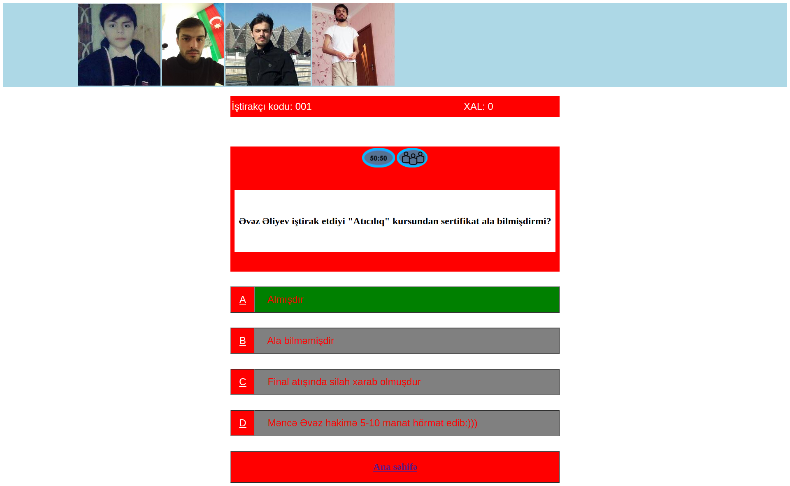

# GITHUB GÖSTƏRİCİLƏRİ

# MILLIONAIRE-GAME

Hello, welcome to this lesson. We tested **MILLIONAIRE-GAME** using HTML-5.  You can follow the steps below to analyze the codes we wrote and the result obtained.
You can watch the **Millionaire** game I compiled using only **HTML** without any **CSS** and **JS**.
   I have used many **HTML** tags here. First, using the **img**, **audio**, **map**, and **area** tags on the front page, I gave the coordinates using the 
 **area** tag instead of "Start the game" in the picture. I also uploaded game music to the beginning of the game (here I gave an invisible sound effect by giving the **audio** tag the **autoplay** attribute). 
   Then I typed the game registration form using the **form** and **input** tags. And for the next part of the game, I used 6 questions here and created separate **html** files for each question. At the top of each question, I created a slide of the pictures related to the question using the **marquee** tag, and I also placed **Clock ("TikTok")** sound in all of these questions using the **audio** tag.
   After finding the correct answer to question 1, **a target = _parent href = "./ tap.html** will automatically show you the correct question. The correct answer is **green** and the incorrect answers are **grey**. appears and also stops **clock sound**. 
   When you answer the 2nd question correctly, this time in the correct answer items comes a short **commercial** that I made earlier with the help of **video** tag. Then go to question 3, giving "Pass the ad". 
  Here we use 2 icons that I placed inside the **table** tag (these are **50:50**, **Audience Help** icons.). In question 3, we use the **50:50** icon, and out of 4 answers, 2 automatically go to the wrong one. And here are 2 answers that are likely to be correct, then we choose the correct answer, and when we move on to question 3, we no longer see the **50:50** icon on our **table**. 
   Then we move on to the 4th question, and as we pass each question, our **Points** increase. In Question 5, we can now use the **Audience Help** icon and the **meter** tag in front of the answers, where we can get help as a percentage in front of the answers. After that, we have reached the final stage by writing the correct answer. 
  Here, if my answer to the question is wrong, we can no longer skip to question 2, and below is the **Home** link, and so we return to the front of the game.

## ## RULES OF USE

> **STEP-1:** `git clone https://github.com/cavidsuleyman/MILLIONAIRE-GAME.git`  
> **STEP-2:**  enter the `MILLIONAIRE-GAME` folder that appears  
> **STEP-3:**  open the folder you are in in a text editor  
> **STEP-4:**  run the `index.html` file in the main folde  
> **STEP-5:**  to download the project as `.zip`  [here](https://github.com/cavidsuleyman/MILLIONAIRE-GAME/archive/refs/heads/master.zip) click  

## Technology

This project was developed using the following technologies

| No | Technique | Purpose |
| - | ---------- | --------------------- |
| 1 | HTML | Building a project skeleton |
| 2 | GIT | Project version control management |
| 3 | VSCode | Text editor used in the project |

## SAMPLE SCREEN APPEARANCE

